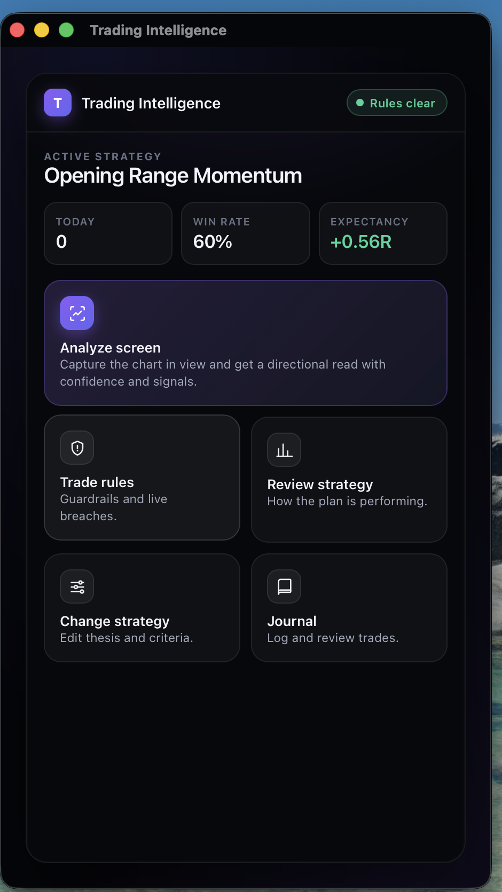
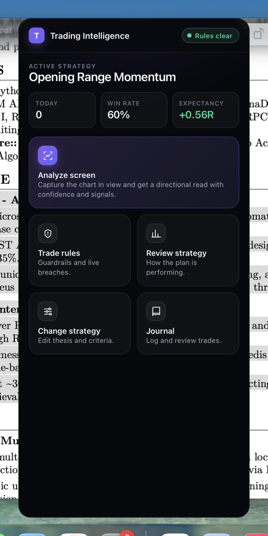
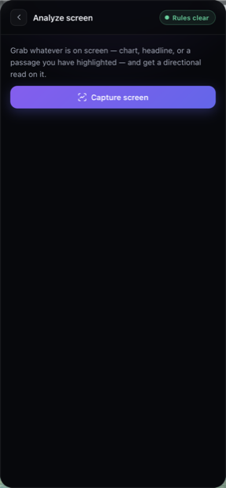
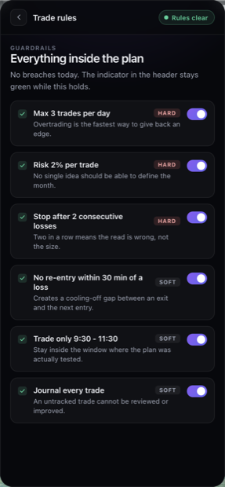
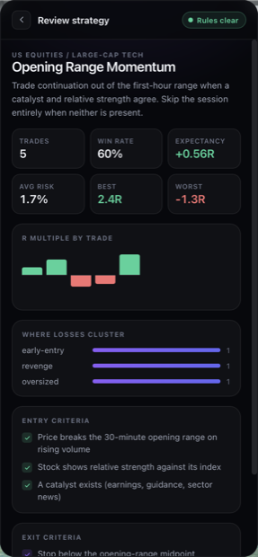
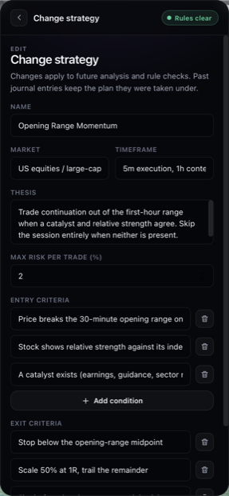
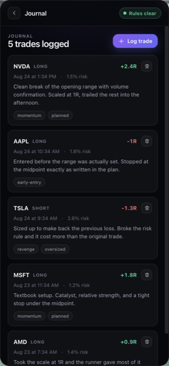
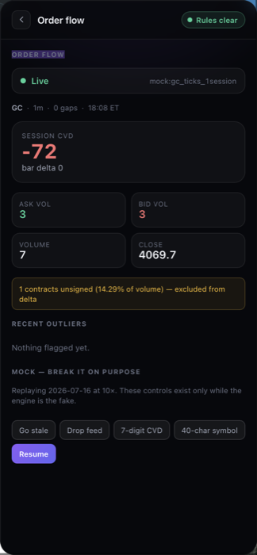
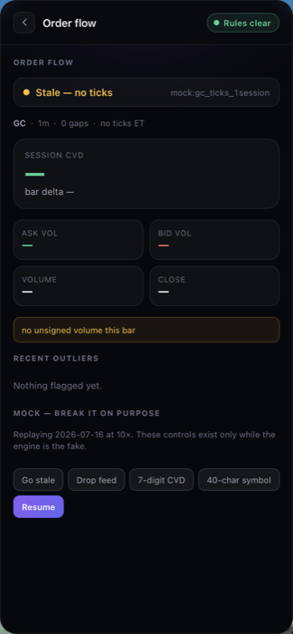
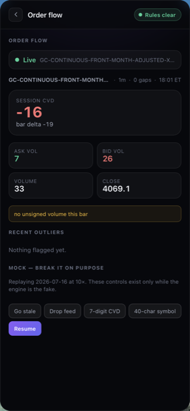

# 2026-09-03 — the Tauri window, finally with eyes on it

Follows [`2026-09-02.md`](2026-09-02.md). Still inside the gap, one day before Week 1 restarts
5 Sep. One item closes today: the Tauri window screenshot that's been open since 25 Aug.

## The blocker, and what actually blocked it

`current.md` row #7 has said since 25 Aug that the window opens at the right geometry (confirmed by
process evidence — one `WKWebView`-backed window, children `Networking`/`GPU` XPC processes alive)
but that **nobody had looked at the pixels**, because Screen Recording permission was never granted
and asking for it interactively wasn't judged worth it at the time.

Asked to continue, `screencapture` failed here too: *"could not create image from display."* The
shell in this session runs inside VS Code's integrated terminal, so the permission needed was for
**Visual Studio Code**, not Terminal.app. Granted, then VS Code was quit and reopened (macOS doesn't
apply a Screen Recording grant to an already-running process) — after that, `screencapture -x`
worked immediately.

**Second, smaller blocker:** the first full-screen capture showed VS Code, not the Tauri window —
VS Code was in genuine fullscreen (its own Space), so the window existed but wasn't on the visible
Space. `osascript -e 'tell application "System Events" to set frontmost of (first process whose
unix id is <pid>) to true'` brought it forward without needing Accessibility permission (a separate,
still-ungranted TCC category from Screen Recording) — Apple Events for `frontmost` don't need it,
UI-scripting keystrokes would have.

## What the screenshot shows



The real native window, cropped from a full-screen capture — not a bundle render, not a headless
Chromium shot. Renders the ported side-panel UI: header (`Trading Intelligence`, a `Rules clear`
badge), an Active Strategy card (`Opening Range Momentum`, Today 0, Win Rate 60%, Expectancy
+0.56R), and five action tiles (Analyze screen, Trade rules, Review strategy, Change strategy,
Journal). **Not blank, not broken, styling intact.**

**Geometry cross-check.** The window's on-screen bounds back-calculate to ~460×820 points at the
display's 2x scale — matching `tauri.conf.json`'s `width`/`height` exactly, the same match the
accessibility-API check found on 25 Aug, now confirmed by an independent method.

**What this does not confirm.** Only one view was on screen — the summary/home view. The Day 2
task ("all six views render, zero console errors") is still open: the other five views were not
navigated to, and no devtools/Web Inspector was attached, so "zero console errors" is unverified —
the terminal log carries no error/warning line, but a WKWebView's own `console.error` doesn't
reliably surface there without an attached inspector. Read "zero errors" claims here as *nothing
printed to the terminal*, not as a devtools-confirmed console.

## Chrome and Firefox, closed on report

Prathamesh reports the rebuilt (`955b374`) extension's capture was verified end-to-end in both a
real Chrome profile and a real Firefox profile, around the 28 Aug gate or before. **Not
contemporaneously logged** — no commit, daily update, or screenshot from the time backs it, so
`current.md` #2/#8 and `week-00.md`'s checklist are closed on that account, flagged as reported
rather than independently verified. If a screenshot or log from the time turns up, it should
replace this note.

## The feed vendor: historical stays Databento, live moves to Ironbeam

Budget-driven decision, reported directly (not the outcome of the 26 Aug quantfeed call — no
record that call happened or what it found; this supersedes that evaluation rather than following
from it). `current.md` C1 rewritten in full. Short version:

- **Historical/backtest track is untouched** — the 19-month Databento archive, S1's contract, and
  the quote-rule validation all stand as documented. Nothing is being re-derived on Ironbeam data.
- **Live moves to Ironbeam** — free L1/L2 for non-professional accounts, free API after 5
  contracts/month traded (else $249/mo), confirmed against Ironbeam's own docs rather than taken
  on faith from the AI-generated build plan that prompted this. One thing that plan got right and
  one real gap it didn't flag clearly: the fee numbers check out; **there is no historical L2/tick
  data via Ironbeam's REST API**, only live streaming, so any book-based work starts from whenever
  capture begins.
- **Ironbeam's trade stream has an `as` (aggressor side) field, but its semantics are
  undocumented** (shows `0` in the example). Treat it as unvalidated until checked against real
  data — the same discipline `pull_tbbo_validate.py` already applied to Databento's `side`.
- **The vendor-licensing question may resolve differently, not just against a different vendor.**
  Ironbeam is a broker: if each end user connects through their own funded account, that's the same
  "runs on the user's machine, uses the user's own entitlement" shape the product already assumes
  for MT5. Not legal advice — needs confirming with Ironbeam and the CA in writing, same as
  everywhere else licensing comes up here.

**Open:** whether the three drafted vendor emails still go out as-is, gain a fourth address, or get
replaced entirely — nobody has redrafted them yet.

## Still open

- [ ] The other five Tauri views, un-viewed; console errors, unverified by an actual inspector
- [ ] Vendor emails (now vendor-uncertain), CA call, Anthropic key, S1 vote, Part B — untouched
- [ ] Ironbeam's `as` field semantics — unvalidated
- [ ] Loading the rebuilt extension in a real Chrome profile *for this session's own verification*
      — still blocked on a native macOS file picker that browser automation can't drive

## Post-trip, same day: CA and data-sourcing move off this tracker; Week 1 readiness checked

Prathamesh back and reviewing the above in conversation. Two process decisions, neither a repo
change by itself, and one readiness check that is: does anything above actually stop Week 1 (5–11
Sep) from starting on schedule.

**CA calls are now off this tracker entirely.** They are being handled manually, directly by
Prathamesh, and will not be reported back for logging. This item has sat in `current.md`'s "not
touched, deliberately" line since the 2 Sep gap entry ("no human... booked the CA call") reading as
an open blocker; it is not one to chase going forward, it is out of the loop by design.

**Data acquisition is being scaled via outsourcing.** Rather than every month being a Databento
call Prathamesh runs himself, more volume is being sourced outside that single-person loop. This
is a direct answer to Day 6's power-analysis finding
(`daily_updates/2026-08-28.md`, `analysis/gc_data_manifest.md`) — even at 19 months the
per-regime/per-strategy cells were thin, 37–112 signals each, and more months was the identified
fix. The mechanics that finding also surfaced — roll-chain integrity, degraded-session
in/out decisions, checksum-verified backup — still apply to whatever arrives regardless of who
pulled it.

**Week 1 readiness, checked against `week-01.md` §4's own dependency table, not assumed:**

- **Prathamesh's lane (`apps/desktop`) is fully clear.** All three pre-week dependencies that
  table names landed before today: `engine/types.ts` + `FeedCreds` (frozen 28 Aug),
  the regenerated month bar table (`analysis/regimes_2026-09-02/`, done in the gap, 2 Sep), and the
  fixture session JSON (exported the same day). D1's task — the overlay skeleton — reads only
  `types.ts`. Nothing outstanding blocks starting Sat 5 Sep.
- **Varad's lane (`services/signal-data`) is clear through D2, not further.** D1 (`regime_filter.py`)
  and D2 (`orderflow.py`/`expansion.py`) touch no threshold values and can start on schedule. **D3
  onward is a hard wall**: `signals/engine.py`'s conditions and every backtest in D4–D6 need Part B
  of `thresholds_selector.md`, and `strategies.py` raises `TypeError` without it. This is not a
  tooling gap — two prior Claude sessions in this repo already declined to author Part B
  themselves, on the reasoning the file states directly: a threshold picked by the assistant is not
  a commitment by the person carrying the trading bias. It was due 28 Aug per that same file's
  status section and is still open. It needs to land before D3 (Mon 7 Sep), or two of Varad's
  seven days go idle on a raised exception rather than a measurement.
- **A new gap, surfaced by today's own C1 decision, not by anything above.** D5 has Prathamesh
  holding a live feed connection for a full 30 minutes in Rust — under the vendor decision made
  earlier today, that connection is now Ironbeam's, and nobody has an Ironbeam account or API
  credentials yet. Not currently tracked as anyone's prep item. Needed before Wed 9 Sep, not
  Wednesday morning.

**Net: Week 1 can start Saturday on the Prathamesh side with zero open blockers. The team-wide
picture is not fully clear — Varad's week stalls two days in unless Part B lands first, and the
Ironbeam credential gap needs a name attached before D5.**

---

# W1D1 pulled forward — the overlay skeleton

**Scheduled Sat 5 Sep, done 3 Sep**, two days early, on the readiness finding above: Prathamesh's
lane had no outstanding dependency, so there was nothing to wait for. `week-01.md` D1 asks for the
Tauri window stripped to the shell — six views at 380px, transparent, borderless, always-on-top,
**no overlay behaviour yet** — and that scope line was held: no click-through, no hit-testing, no
position memory. Those are D3 and D6.

## The number

> **Six views render, zero console errors in the real webview, window geometry matching
> `tauri.conf.json` to the pixel.**

All three, and the middle one is the interesting part.

**Geometry: 380×820, confirmed twice.** `tauri.conf.json` says `380 × 820`; the accessibility API
reports the running process owning one window, `Trading Intelligence`, **380×820 at (545, 37)** —
and it read the same on all six captures, so the width is not something a view can push around.

**Six views render.** Home, analyze, rules, strategy-review, strategy-change and journal, each
captured from the real native window. Nothing is clipped or reflowed at the narrower width — the
two-column tile grid, the R-multiple chart, the rule rows with their HARD/SOFT badges and the
journal cards all hold at 380 where they were built for 412.



The home view, captured with the surrounding desktop left in frame **on purpose** — it is the
evidence for three separate claims at once. No titlebar and no traffic lights (`decorations:
false`). The document window behind it stays behind it (`alwaysOnTop: true`). And the desktop shows
through *outside the rounded corners* rather than being boxed in black, which is what proves
`transparent: true` actually took effect rather than silently degrading.

| | | |
| :--- | :--- | :--- |
|  |  |  |
|  |  | |

## "Zero console errors" was an unverifiable claim, so it got a mechanism

This morning's entry recorded the gap plainly: a `WKWebView` does not reliably forward
`console.error` to the terminal that launched it, no inspector was attached, and therefore "the
terminal log is clean" was **not** evidence of a clean console. D1 asks for exactly that claim, so
the claim needed something behind it.

`src/lib/webviewLog.ts` + a `log_webview` Rust command: `console.error`/`console.warn` are wrapped
(not replaced — the original still runs, so an attached inspector sees what it always saw), and
`error` / `unhandledrejection` listeners catch the two failure classes that never reach
`console.error` on their own. Everything arrives on the process's stderr as a `[webview:*]` line.

**The bridge was proved to discriminate before it was trusted.** A temporary probe firing one of
each was added and the log was checked:

```
[webview:error] BRIDGE_PROBE_ERROR
[webview:warn] BRIDGE_PROBE_WARN
[webview:unhandledrejection] Error: BRIDGE_PROBE_REJECTION
```

Probe then removed. **Across the whole run — six views, several HMR reloads — those three probe
lines are the only `[webview:*]` lines in the log.** Zero real errors, and now "zero" means
something, because a run that had errors is known to look different.

**One honest deduction from its value.** Vite 8's dev client *also* forwards `console.error` to the
terminal, which showed up next to the probe lines. So in `tauri dev` specifically the terminal was
not as blind as this morning's entry assumed. The bridge still earns its place — Vite's client does
not exist in a built app, and it does not catch `unhandledrejection` — but the honest framing is
that it makes the check true in **production** builds, not that it was the only way to see an error
in dev.

## What changed, and one thing that had to change with it

- **`tauri.conf.json`** — `380` wide, `transparent`, `decorations: false`, `alwaysOnTop`,
  `shadow: false` (a system shadow draws a square outline around a rounded transparent window),
  and `macOSPrivateApi: true`.
- **`Cargo.toml` — `tauri` gains the `macos-private-api` feature, and this is not optional.**
  Without it the build **fails loudly** rather than producing an opaque window: *"The `tauri`
  dependency features on the `Cargo.toml` file does not match the allowlist defined under
  `tauri.conf.json`."* Found by hitting it, and it is the good failure mode — a transparent window
  that silently is not transparent is the one that wastes an afternoon in Week 3.
- **`theme.css`** — `body` paints nothing (anything it painted would be an opaque rectangle in the
  corners the window rounds off) and `body.standalone .shell` fills the window edge to edge instead
  of being centred in a decorative backdrop. `--panel-w` 412 → 380, matched to the window.
  **The shell itself stays opaque on purpose:** window transparency here buys rounded corners and
  no titlebar. A translucent *panel surface* is a legibility trade-off over a live chart and a
  hit-test question, and both belong to D3.
- **`SidePanel.tsx`** — `data-tauri-drag-region` on the topbar and its spacer. A borderless window
  has nothing to grab; without this the overlay cannot be moved at all.
- **`capabilities/default.json`** — `core:window:allow-start-dragging` granted explicitly. It may
  already be inside `core:default`; the generated manifest did not resolve the nested set cleanly,
  and guessing wrong means an immovable window, so it is named rather than assumed.
- **`lib.rs`** — the scaffold `greet` command is gone (dead since `create-tauri-app`, referenced
  nowhere in `src/`), replaced by `log_webview`.

## Verified, and not

`pnpm build:all` green across all three projects; `cargo build` clean; no tracked `dist` dirtied.

**Not claimed:**

- **Navigation by clicking was never exercised.** Synthetic clicks need Accessibility permission,
  which is still ungranted (`osascript` returns `-25208`) — the same TCC gap this morning's entry
  hit from the other direction. The five non-home views were reached by temporarily setting the
  initial view and letting HMR reload, then restoring the file. **That proves each view renders,
  which is what D1 asks for; it does not prove the tiles and the back button navigate.** Worth
  closing whenever Accessibility gets granted — it is also the permission D3 will want.
- **Dragging the window by its topbar is untested for the same reason.** The attribute and its
  permission are in place; nobody has moved the window with a mouse.
- **`apps/desktop` and `apps/extension` have now genuinely diverged.** `theme.css` and
  `SidePanel.tsx` were byte-identical copies (Day 2, 24 Aug); the overlay changes apply to the
  desktop copy only. The extension is unaffected — `body.standalone` never applies there, since
  `isExtension()` is true — and its build is green, but the "byte-for-byte identical" property is
  spent, and that was always going to happen the day the desktop app became an overlay.
- **A macOS-only result.** `macos-private-api`, the shadow behaviour and the TCC prompts are all
  platform-specific; nothing here says how this window behaves on Windows.

---

# W1D2 pulled forward — `engine/mock.ts`, and it found two real bugs

**Scheduled Sun 6 Sep, done 3 Sep.** S2's fake: replay the committed fixture session at 10×, emit
`DeltaBar` / `Outlier` / `FeedStatus`, and **misbehave on demand**. `contracts.md` S2 is explicit
that Prathamesh writes this one "because he is the one who needs it to behave badly on demand".

## The bars are real, and they reconcile with `s1.py`

`barTicks()` bars the 77,532-tick fixture at one minute using the same conventions
`services/signal-data/s1.py` uses. The whole session was checked against the numbers that file
produces — a different language, a different author, the same fixture:

| | got | want |
| :--- | ---: | ---: |
| ticks | 77,532 | 77,532 |
| session delta | **+1,842** | +1,842 |
| volume | **110,817** | 110,817 |
| last bar CVD | +1,842 | +1,842 |
| askVol − bidVol | +1,842 | +1,842 |
| unsigned volume | **2,271** | 2,271 |

**The check discriminates**, which is the part that matters: an inverted `B`/`A` mapping yields
**−1,842**, not +1,842. That inversion is the trap `DELTA_CVD_FINDINGS.md` records — `'A'`/"Ask"
does *not* mean "printed at the ask", it means a **sell**er aggressed, so `'A'` lands in `bidVol`.
It reads backwards and produces a mirror-image CVD that looks entirely plausible. The mapping is
`s1.py`'s `SIDES` and the comment above it says why in full.

**Two numbers landed that were not aimed at.** The unsigned volume comes out at **2,271 contracts
from 1,811 trades (2.34%)** — exactly the figures `contracts.md`'s pending `'N'` amendment carries
— and the bar count is **1,379**, matching the smoke run recorded in `current.md` on 26 Aug. Neither
was used to build anything; both agreeing is an independent join.

**The `'N'` amendment needs no contract change to be honoured.** S2 can already express the
unsigned share: `volume` counts every trade while `bidVol`/`askVol` count only attributed ones, so
`volume − bidVol − askVol` *is* the unsigned volume. The Flow view reports it next to delta, which
is what the drafted amendment requires of any consumer.

**The outliers are not real** and the file says so at the top: plausible shapes for laying out a UI,
from a deliberately crude rule, no threshold in them derived from anything. Stage 1's candidates are
Varad's and live in `strategies.py`.

## The number: four failure modes, and what each does to the layout

| | |
| :--- | :--- |
|  |  |
| **Live.** Session CVD, bar delta, the two legs, and the unsigned-volume line. | **Stale.** Amber, *"Stale — no ticks"*, **vendor still shown** — connected but not receiving, which S2 calls out as the state that looks like a quiet market and is not. |
|  |  |
| **Dropped.** Red, vendor cleared to `—`. Deliberately distinguishable from stale at a glance. | **40-character symbol and vendor.** Both ellipsise, the metadata row stays on one line, nothing overflows 380px. |

**The 7-digit CVD mode — reported closed by Prathamesh, on-device, not independently screenshotted.**
Four of my own capture attempts failed on display sleep and the window sitting on a non-visible
Space. Prathamesh then tapped the button directly on his own machine and reported the field rendered
a 7-digit value without breaking the layout, for about the one second before the next real bar
(~6s at 10× replay) overwrote it back to a normal value — which is `emitWideCvd()`'s designed
behaviour (it patches in exactly one bar), not a bug. **Same treatment as row #2/#8 above**: closed
on his account rather than on a logged artefact from the time, because three attempted screenshots
either missed the app entirely or landed after the value had already reverted. The field carries
`tabular-nums`, `nowrap` and `text-overflow: ellipsis`, so it was guarded by construction going in;
this is the first time anyone actually saw it fire.

**Incidental confirmation:** this is the first button in either app anyone has actually clicked —
everything in this file and the W1D1 entry was fired programmatically, since Accessibility is still
ungranted in my own environment. One tap on one control is not the same as the six home tiles, the
back button, the topbar drag region or the other four mock controls all being exercised, but it is
the first data point that clicking works on the real device at all.

## The two bugs it found, which is the reason the day exists

**1. A late subscriber never learned the feed was live.** `onStatus` did not replay the current
status on subscribe, and `emit` only pushes a state change when the state actually *changes* — so a
steady `live` feed never announces itself. Any view mounted after connection showed its local
default, **"Disconnected" over a working feed**. Caught in the very first screenshot of the day.
Fixed by emitting the current status to each new subscriber. **`real.ts` must do the same**, so this
is written down rather than just patched.

**2. Two replay schedulers could run at once, and it made every failure mode look broken.**
`connect()` cleared its timers *before* awaiting the 4.8MB fixture, so two overlapping connects both
got past the clear before either scheduled, and each started its own chain. Only the newest timer id
was retained, so the older chain was orphaned — uncancellable, still emitting, and `emit()` set the
state back to `live` on its next bar. **That is why `goStale()` and `drop()` appeared to do nothing
through three separate rounds of investigation.** Fixed with a generation counter that any stop
bumps, plus a memoised load so the fixture is fetched once. React StrictMode's double-mount
reproduces it on every dev start, which is the cheapest reproduction anyone could ask for.

Neither bug is mock-only in character. Both are the kind that survive into a real adapter.

## Verified, and not

`pnpm build:all` green across three projects, `tsc --noEmit` clean, and **zero `[webview:*]` error
lines** across the whole session — every one that appeared was a deliberate probe or a temporary
trace, both removed.

**Not claimed:**

- **Nothing was clicked by me.** Accessibility is still ungranted in my environment, so my own
  testing fired every failure mode programmatically on mount. Four of the five mock controls, the
  six home tiles, the back button and the drag region remain unproven by an actual click — only the
  7-digit CVD button has now been tapped for real, by Prathamesh, above.
- **There is still no JS test runner in this workspace.** The reconciliation above was checked by
  compiling `barTicks` standalone and running it under Node — real, repeatable, but not a committed
  test, and it will not run in CI because there is no CI for the TS side. Adding `vitest` is a
  lockfile change and the standing constraint says that gets its own reviewed commit, so it was not
  smuggled in here. **Weeks 1–3 are all UI work against this fake and it has no tests** — worth a
  decision, not a silent gap.
- **`engine/real.ts` does not exist**, so `VITE_ENGINE=real` throws by design rather than falling
  back to the fake. Replayed July ticks silently standing in for a live feed is the worst failure
  this seam could produce.

---

## Evening — Part B's factual fields

Asked for **the factual half of `thresholds_selector.md` Part B and nothing else.** Every `<...>`
that is a commitment — thresholds, hit rates, realized moves, MAE tolerances, the "what would make
me say no" line, the prediction — is still blank and still Varad's. That is the third session to
stop at that line, and the reason has not changed: a threshold picked by an assistant is not a
commitment by the person with the bias. Provenance is not a commitment, which is why this half
could be written.

### What went in

A shared **Data** table above the four blocks, and the four `Data:` lines now point at it:

| | |
| :--- | :--- |
| Month | 2026-07-01 → 2026-07-31, **23 sessions**, **6,276** five-minute bars |
| Parquet | `data/2026-07/gc_trades.parquet`, 1,616,772 trades, `sha256` `45947e88eb20f414…` |
| Contract | `GCQ6·GCZ6` — a **roll month** |
| `'N'` | **3.89%** (the month), not 2.34% (the fixture session) |
| Labels | `regimes_2026-09-02`, **6,023 of 6,276** bars labelled |
| Split | ≤ 19 Jul → 13 sessions / 3,373 bars · after → 10 sessions / 2,650 |
| Tick | 0.10 = $10.00 |

**The hash was re-computed, not copied.** `shasum -a 256 data/2026-07/gc_trades.parquet` returns
`45947e88eb20f414e0ad39887c3bebd6a75d4a3063a2c8f2230a1f8fa754a486`, matching
`analysis/gc_data_manifest.md`'s first-16 to the character. The month the Part B blocks now name is
demonstrably the month every validated delta number in the repo was computed on.

Also in: `week-01.md` §2's sample-size table, placed next to the "minimum sample size before I
believe any of it" line it constrains — at 50–150 signals nothing below ~29% is provable, so a
floor of 30 and a 26% hit-rate commitment cannot both be written.

### The one measurement, and it moves a plan assumption

W1D1 asks for the median 5-minute bar range in ticks and calls it "the single number that decides
whether Day 4's measurement is even well-posed." It is **scale, not outcome** — it says nothing
about delta, returns or hit rates — so measuring it now leaks nothing into the thresholds still to
be written.

Over all 6,276 bars: **median 38 ticks**, p25 27, p75 55, mean 45.4.

`thresholds_selector.md` carried **15 ticks**, which is the *minute*-bar figure, and the
`absorption_fade` note reasons about a 5-minute proxy with it. Against 38:

- **stop 20 ticks = 0.53× a median bar** — half a bar, inside the bar it is measured on
- target 70 ticks = 1.8×

So target and stop are frequently both touched inside one bar and OHLC cannot order them. **D4's
answer to "is this well-posed at bar resolution" is no**, which promotes its tick-resolution run on
the fixture session from a nice-to-have to the thing that produces the error bar. The
`absorption_fade` time-bar proxy is *looser* than the existing note assumes, not tighter — relevant
to decision 2, which may delete that rule rather than tune it.

Noted alongside: the fixture session **2026-07-16** — the free absorption test case, and a Week 1
gate line — sits in the **training** half of the 19 Jul split.

### Left alone deliberately

**Both regime READMEs still print `--parquet data/gc_trades.parquet`.** That path has not existed
since the 28 Aug reorg moved every month under `data/<YYYY-MM>/`, so the documented re-run command
does not run as written. The file it means is unambiguous and its hash matches — but what the 2 Sep
run actually read is Prathamesh's to confirm, not something to assert on his behalf. Flagged in
`current.md`, not silently fixed.

**Unchanged and still blocking:** Part B's commitment fields, and `plans/team/varad/thresholds.md`,
whose own header made it due this morning. D3 is Mon 7 Sep.

---

## Night — the `'N'` amendment, re-verified before it goes to a vote

Asked to fix the `'N'` number before the gate. **The number in `contracts.md` was already fixed** on
28 Aug (`99fac6b`), which the morning's read of this file missed. **The stale copy was
`plans/team/varad/2026-08-28-gate-note.md`** — item 1, the thing the room actually reads and votes
from. It still carried the fixture's `1,811 trades, 2.34%, 2,271 contracts` and quoted a version of
the drafted wording that `contracts.md` had superseded five days earlier, while labelling it
"verbatim from `contracts.md`."

That is the more dangerous of the two failures. A wrong number in a reference file gets corrected the
next time someone reads it; a wrong number in the pre-read for a vote gets *decided on*.

### Re-verified against the parquets, not the manifest

Every figure recomputed from all 19 files (46,034,813 trades) rather than copied from
`gc_data_manifest.md`'s table:

| scope | trades | volume |
| :--- | ---: | ---: |
| fixture, 2026-07-16 | 2.34% | 2.05% |
| July 2026 | 3.89% | 3.65% |
| 19 months pooled | **2.73%** | **2.68%** |
| range | 1.15 – 5.23% | 1.21 – 5.06% |
| roll, n=9 | 3.75% | 3.73% |
| mid-cycle, n=10 | 1.92% | 1.90% |

**Every trade-share number in the amendment reproduced exactly.** The roll/mid-cycle split, the
range, the overlap claim (roll minimum 2.68% against mid-cycle maximum 3.63%) — all confirmed.

### The volume column, which nobody had measured

The amendment's argument is that `'N'` rows contribute 0 to delta, so delta is least complete during
rolls. **Delta is volume-weighted, so a trade-count percentage only bounds that if unsigned trades
are ordinary-sized** — an assumption the amendment made silently.

Measured: the two columns track within **0.2 pp in every one of the 19 months**, and unsigned rows
are very slightly *smaller* than average (2.73% of trades, 2.68% of contracts). The assumption
holds, and it is now on the record instead of implied.

### Two corrections

**1 — July 2026 is in-sample.** `contracts.md` said its 3.89% "was not among the months that produced
that mean, so that is an out-of-sample fit rather than a fitted one." July is a roll month
(`GCQ6`→`GCZ6`) and is one of the nine in the 3.75% mean. Drop it and the other eight average
**3.73%**, which July sits 0.16 pp above. Consistent — but presented as independent confirmation it
was not, and a room voting on a frozen contract should not be handed that.

**2 — the month parquets spell it `unknown`.** Verifying this meant filtering
`aggressor_side == 'N'` across all 19 files, which returned **zero rows in every month** and briefly
read as the amendment being about nothing. `'B'/'A'/'N'` is what `cut_s1_fixture.py` writes into the
S1 fixture; the month files carry `buy_initiated` / `sell_initiated` / `unknown`, per
`pull_futures_trades.py`'s `"N": "unknown"` map. `s1.py`'s `SIDES` already accepts both spellings and
raises on unknown codes, so no code path is exposed — but the next person to sanity-check this claim
by hand hits it, so it is now flagged in `contracts.md`, the gate note and the manifest.

### What was deliberately not changed

**The drafted wording itself.** The evidence around it is corrected; the sentence being voted on is
the same one as on 28 Aug. Rewriting it would turn a yes/no into a new proposal, which is the one
thing the freeze discipline exists to prevent.

**Still unheld:** the vote. Four asks in the gate note, no room with all three since 26 Aug.
