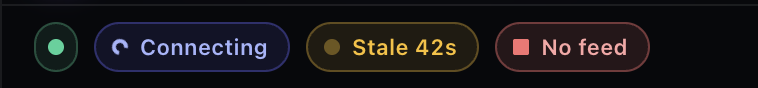
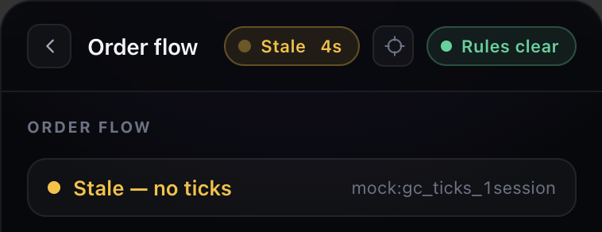
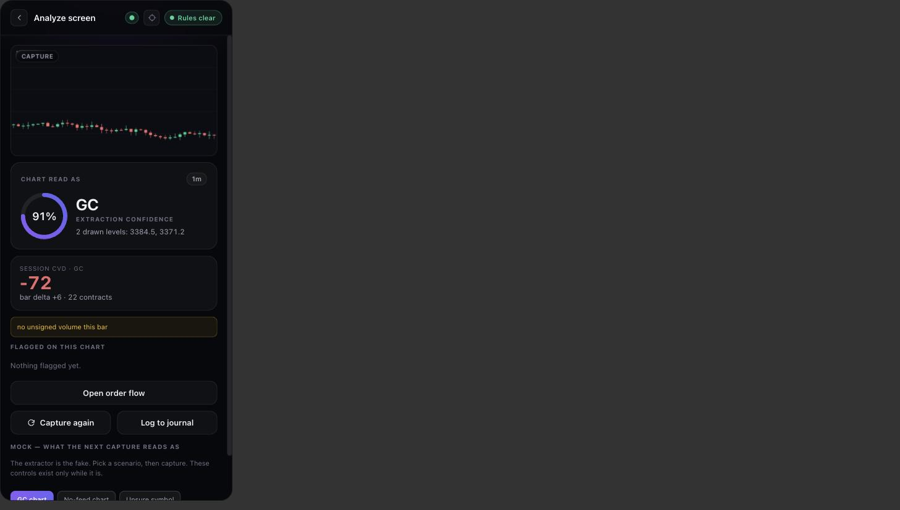
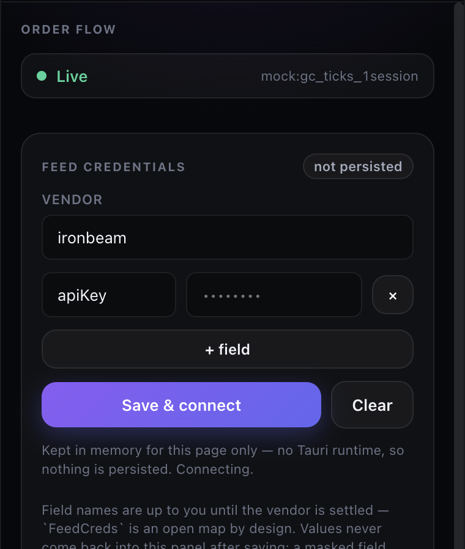

# Daily Update — 2026-09-17

**Branch:** `main`
**Reference:** [`plans/current.md`](../plans/current.md), rows R8 and B · [`plans/team/prathamesh/README.md`](../plans/team/prathamesh/README.md) Week 2

---

## 1. Summary

**Sync and sweep, nothing new started.** Pulled `f4e5a87` and `7d2a262` from `origin/main`
(fast-forward, no local commits waiting). Re-verified on this machine: **331 passed**, `ruff` clean,
`mypy` clean across 56 files — matches what 14 Sep §9 reported.

**One thing was genuinely pending and needed no person: `replay.py`'s two cache directories were
never gitignored.** `analysis/.replay_cache/` (616K) and `analysis/.replay_path_cache/` (232K) have
been sitting untracked in `git status` since R8 ran on 11 Sep. They are the same class as
`.reach_cache/` — derived, rebuildable per month, and stamped by `_checked_cache` with the parameters
they were produced under — and `.reach_cache/` was ignored on the day it was created. These were not.
Ignored now, with the same comment shape, next to the `.reach_cache` line.

## 2. Swept, and still blocked on a person

Same table as 14 Sep §9, unchanged, none of it movable from this machine:

| | Item | Whose |
| :-- | :--- | :--- |
| R7 | MT5 tick depth — desktop terminal, real broker's demo server, not `MetaQuotes-Demo` | Varad |
| #0 | The Anthropic key | Varad |
| R5 | ET-not-UTC boundaries unsigned | Varad |
| R10 | Week 1 gate votes blank | The room |
| C1 | Databento live never priced | Shreyas |
| #9 | Ironbeam account and API credentials | Prathamesh |
| B | Prove the overlay floats over a live MT5 desktop terminal — code is all in (`5bafded`, `e0171bf`); the on-device proof is not | Prathamesh |

Two standing gaps also unchanged: Accessibility permission ungranted, and no JS test runner in the
workspace (a `vitest` add is a lockfile change and wants its own reviewed commit, not a sweep).

**Checked rather than carried:** the 25 Aug item *"`analysis/regimes/` is stale and must be
regenerated"* was closed by `2568026` on 2 Sep (`regimes_2026-09-02/`). The old directory's README
correctly marks it superseded; nothing to do.

## 3. What changed on disk, first pass

```
.gitignore                    +2 ignored dirs, .replay_cache/ and .replay_path_cache/
daily_updates/2026-09-17.md   this file
plans/current.md              row R8
```

**Committed as `bd74b23`.**

---

## 4. Varad's queue, swept — and two of his blockers had already been cleared

Asked what of Varad's was left and to finish what could be finished. **Most of it genuinely needs
his hands. Two items were not open at all, and one repo claim was worth re-proving rather than
citing.**

### Closed by verification

**R5 carried three "still open" clauses. Two were stale.**

✅ **"Varad has not signed the ET-not-UTC boundaries" — he signed them on 6 Sep.** The sign-off is in
this repo, ticked, in `current.md`'s own 6 Sep (night) block. **Rather than close a row by pointing
at another row, the check behind the signature was re-run today:**

```
2025-03-09   360 bars   in 01:00-03:00 ET = 0   ET hours present = [18..23]
2025-11-02   360 bars   in 01:00-03:00 ET = 0   ET hours present = [18..23]
2026-03-08   360 bars   in 01:00-03:00 ET = 0   ET hours present = [18..23]
```

**All three DST transitions in the archive, zero bars in the window, reproducing the 6 Sep claim
exactly** — because the transitions fall inside the Fri-17:00 → Sun-18:00 break, so `Asia-London`
never loses or doubles a day. Safe by construction, and now checked twice eleven days apart.

✅ **"`replay.py` unstarted" — it is R8.** 28,945 bytes on disk, 19 months, 89,646 ties reconciled to
`reach_table.csv` to the unit. The clause predates step 5 and was never updated.

⚠️ **Genuinely open, and the only one of the three:** the large directional intraday pattern M3's
null cannot control for. Unstarted, and by this repo's own rule it needs its prediction and kill
condition committed *before* the code that reads them — so it is a real experiment, not a sweep item.

### Checked, and correctly still his

🔑 **Row #0, the Anthropic key.** Verified the repo half rather than assume it: both `.env.example`
files carry placeholders (`sk-ant-xxxx…`, `db-xxxx…`), and searching **every commit in history**
for a non-placeholder `sk-ant-` returns nothing. **The repo is clean and always was** — the exposure
was a chat transcript, which no amount of repo hygiene reaches. **So the row is exactly what it
says: ten minutes at `console.anthropic.com`, revoke not rotate, and nobody but Varad can do it.**

### Cannot be finished from here, and why

| Item | Blocker |
| :--- | :--- |
| R7 — MT5 tick depth | Needs the **desktop** terminal on a real broker's demo server. Not `MetaQuotes-Demo` (14 Sep §10), and not the web terminal, which runs no scripts |
| #0 — Anthropic key | A console action on Varad's account |
| R10 — Week 1 gate votes | Three people. A decision one person writes down is not a decision three made — the standard S7 was held to |
| `first_touch` | Recommendation recorded 14 Sep §5 and it is **"do not move it"**; the change is one line if he disagrees. Awaiting his call, not more analysis |

**Nothing was invented to look busy.** Of Varad's five open items, two were already done, one was
verified as correctly blocked, and two wait on a person.

---

## 5. Later — W2D2's hotkey, the one Week 2 item that was code and not a person

Today is Week 2 Thursday on the shifted calendar. Swept Prathamesh's Week 2 against `main`:
click-through (`e0171bf`) and position memory (`909fe78`, `54ac312`) are Monday's and done; the
380px view port is in. **Tuesday's global summon/dismiss hotkey was not** — `lib.rs` registered
exactly one shortcut, the `⌘⇧K` disarm, and its own comment said so. Thursday's command-layer session
needs Varad in the room and Friday's compositing measurement needs an MT5 desktop terminal, so this
was the only Week 2 item movable from one machine.

**Built:** `Cmd/Ctrl+Shift+O` toggles the overlay. `plans/team/prathamesh/README.md`'s one-line
spec — *"working while MT5 has focus. That clause is the entire difficulty"* — is the same property
the disarm already needed, so it is the same OS-level registration. Three choices worth recording:

- **Toggle from the window's own `is_visible()`, on the Rust side.** Not a React flag: a wedged
  frontend must not stop the trader getting their chart back, for the same reason the disarm never
  went through JS. `is_visible` failing reads as visible, so the fallback is *hide* — the window
  that will not go away is the one that gets uninstalled.
- **Summon takes focus.** `show()` alone reproduces the W1D3 failure — a window that is *active*
  but not *focused* — so it is `show().and_then(set_focus)`.
- **Handler identity by registration, not by matching.** The disarm's first version matched the
  pressed combo against `Modifiers::SHIFT` alone and silently never fired; the file's fix was "only
  one shortcut exists, so skip the check". That fix cannot survive a second shortcut. Both now use
  `on_shortcut(combo, handler)`, one closure each, so neither ever inspects a modifier bitmask.

**Why `O`:** MT5's documented default hotkeys are F-keys, `Ctrl`+letter and `Alt+1/2/3/W` — no
`Ctrl+Shift+letter` — and it sits next to `K`. ⚠️ **cTrader's defaults were not checked.** This is
a default, not a contract; rebinding is a Week 4 preference item.

**Verified from outside the app, on macOS**, because that clause is the whole difficulty:

```
frontmost: Google Chrome
⌘⇧O via System Events  ->  [overlay] hidden
⌘⇧O                    ->  [overlay] shown
⌘⇧O                    ->  [overlay] hidden
⌘⇧O                    ->  [overlay] shown
⌘⇧K                    ->  no error (disarm path unchanged)
frontmost after: desktop     (set_focus on summon, as designed)
```

The `[overlay] hidden|shown` stderr line is new and deliberate — same prefix discipline as
`log_webview`, and **it is the only evidence available**: neither System Events (Accessibility
ungranted, reports 0 windows) nor `CGWindowList` (on-screen-only listing returns nothing for any app
from this shell) can see a borderless window toggle. A CGWindowList probe did confirm the 380×820
window exists at layer 5 at its remembered position, which is as far as an outside observer gets.

`cargo build` and `cargo clippy` clean, `tsc --noEmit` clean. Windows and Linux untested, same as
every other line in row B.

**Not done, and honestly not doable here:** the click-through proof over a real MT5 *desktop*
terminal, and Friday's compositing numbers. No MT5 desktop build is installed on any machine in the
loop (`ls /Applications` — none), and 14 Sep §10 already established the web-terminal account is not
a substitute for either.

### What changed on disk, third pass

```
apps/desktop/src-tauri/src/lib.rs   SUMMON_SHORTCUT, toggle_overlay, per-shortcut handlers
apps/desktop/src/SidePanel.tsx      crosshair tooltip names ⌘⇧O
daily_updates/2026-09-17.md         §5
plans/current.md                    row B
```

**Committed as `ed0154f`.**

---

## 6. M3b — the last of Varad's real work, and there is no time-of-day drift

The one genuinely open item from §4 is done. **`M3_CLOCK.md` §6 has carried it since 6 Sep:** a
pattern it logged and explicitly refused to claim — `London-NY` −0.018 long / +0.035 short,
`Asia-London` +0.036 long / −0.031 short, large, opposite, growing with a wider stop — with the note
that *"M3 is non-directional and its null controls for side but not for time-of-day drift. It needs
its own experiment and its own null."*

**Pre-commitment first, and it is a separate commit.** `strategy-precommit.md` §12 landed as
`444881b` **before the first line of `m3b_drift.py` existed** — prediction, reasoning and a
three-way kill condition, per the rule that outlives that file.

### The result

```
18,244 disjoint 30m windows, 19 months
POOLED drift   +0.1878 bp per window      cost floor   0.3504 bp round trip

                n   mean_bp  resid_bp   se_bp      t   edge_lo  clears
Asia         6508    0.2909    0.1031  0.2621   0.39   -0.4210   False
Asia-London   814    0.9794    0.7916  0.6423   1.23   -0.4930   False
London       4070    0.2463    0.0585  0.3004   0.19   -0.5423   False
London-NY    1223   -0.2992   -0.4870  0.8082  -0.60   -1.1295   False
NY           3257   -0.2538   -0.4416  0.4887  -0.90   -0.5359   False
NY-Asia      2372    0.3902    0.2024  0.3780   0.54   -0.5536   False
```

**0 of 6 clear. Outcome 1 fires and the pattern is retired.** Full write-up:
[`analysis/M3B_DRIFT.md`](../services/signal-data/analysis/M3B_DRIFT.md).

**The core of the prediction is the finding.** The period's **entire** unconditional drift is
**+0.1878 bp per 30 minutes against a 0.3504 bp round trip** — barely half. **Before any phase is
examined, the whole bull market cannot pay for the trade that would capture it**, so a phase's share
of it never had room to clear cost.

### Three things that needed care

⚠️ **The signs replicate, and that is the result most at risk of being over-read.** `London-NY` came
back **negative (−0.487 bp)** and `Asia-London` **positive (+0.792 bp)** — exactly M3's implication,
through an instrument with no bracket in it. **Scored as a retirement anyway:** nothing reaches
t = 1.25 and every `edge_lo` is below zero. **A sign that replicates at t < 1.3 is what noise looks
like when you go looking in the direction you expect** — and the two phases involved are the
**thinnest in the table** (814 and 1,223 windows against `Asia`'s 6,508), the same two transition
phases `REACH.md` found losing their whole CONTRACTING state.

✅ **Outcome 3 did not fire, which is the good news nobody would otherwise notice.** Had the signs
come back *opposite* to M3's, the bracket rather than the tape would have produced that asymmetry,
and every per-side number in `M3_CLOCK.md` would have gone back into question. They agree. Nothing
goes backwards.

⚠️ **A published number is wrong.** `M3_CLOCK.md` §6 says *"a period when gold rose 84%"* and §12
repeated it without checking. **The archive rose 55.2%** — 2,640.40 → 4,098.60, first close to last.
Correcting it moves the predicted drift from 0.33 bp to **0.241 bp**, i.e. *toward* the 0.1878
measured, with the remainder explained by the weekend and session-break gaps M3b drops by
construction (78% of the rise falls inside tradeable windows). **The prediction was right and its
arithmetic was carrying someone else's error.**

### What was built

`m3b_drift.py`, 134 lines, 6 tests, no network. **Both guards mutation-verified rather than
assumed:** removing the pooled-mean subtraction turns the null test red, and removing the
elapsed-time filter turns two tests red. One line was deleted during lint cleanup on the claim that
it was redundant — **and that claim was checked, not asserted: the re-run reproduces the CSV byte
for byte.**

**337 passing** (was 331), `ruff` and `mypy` clean across 58 files. `backtest.py`, `m3_profile.py`,
`m1_sweep.py` and the served table are untouched.

**R5 is now fully closed.** Everything still open across the whole plan needs a person — the table
in §4 stands unchanged.

---

## 7. Everything left now has a date

With R5 closed, **every remaining item on the board is blocked on a person rather than on work** —
which is exactly the state things slide from. `current.md` has a new **`## Scheduled`** section
giving each one an owner and a calendar date.

**The reason it is dates and not week numbers.** `gates.md` still carries the **unshifted**
schedule — it dates Week 3 to Sep 18 — while `current.md`'s header records everything moving a week
right on 28 Aug. The two disagree by a week, and R10's *"Week 2 is Week 1's gate"* is **still
unvoted**, so a week number is genuinely ambiguous right now and a date is not. **The next gate is
Friday 18 September, 16:00**, whatever it ends up being called. Verified the weekdays rather than
assuming them: 18 and 25 Sep are Fridays, 21 Sep is a Monday, and R10's proposed 4 Dec Week-12 end
is also a Friday.

**Tomorrow, before the gate:**

- **#0, the Anthropic key** — ten minutes, and it is a Week 0 gate line that will otherwise be
  recorded unmet for the **fourth** gate running. §4 verified the repo half is already clean, so the
  console click is the entire remaining task.
- **Install the MT5 *desktop* terminal on a real broker's demo** — scheduled first because it is the
  **shared prerequisite**: R7's depth check, B's overlay proof and the compositing measurement all
  come free in the same sitting. Not `MetaQuotes-Demo`, not the web terminal.
- **R7's depth check** — five minutes after that, and **the highest-leverage item on the board**:
  §415 makes route-2 spot the last thing between here and `M4 decided`, with M1, M3, M2, replay and
  the PDE all finished behind it.

**At the gate:** R10's blank votes, the calendar decision, the `first_touch` call (sitting since
14 Sep, recommendation is *no*), and Shreyas sending the Databento pricing ask so the number is in
hand a week later.

**Two things were deliberately NOT given dates**, and that is the point of the section rather than
an omission. **M4** is blocked on route-2 spot which is blocked on tomorrow's depth check — it
schedules itself the day that lands, and dating it now would be inventing a date. **`mbp-1`
pricing** reopens only if route 2 dies. **And #9, the Ironbeam account, was put *downstream* of C1
rather than beside it:** C1 reopened on 5 Sep proposing Databento live *instead* of Ironbeam, so
funding an account before that decision is spending against a vendor the room may not pick.

**The rule attached to it:** a missed date is **recorded as missed in that day's update and keeps
the next slot**. It does not quietly reappear a week later unremarked. A date moves the way a gate
slides — unanimously, and written down. R10 is in this repo as the case for why that rule needs
saying out loud.

---

## 8. Later still — W3D1's status indicator, pulled forward: the feed now belongs to the shell

Asked to finish what can be finished in Prathamesh's lane ahead of the strategy work. Week 3 Monday
is *"connection status UI — four states from S2, stale is the one that matters, visually distinct
from three feet away."* Two things were wrong with what existed, and neither had been noticed
because nobody had opened a second view while watching the feed:

1. **The engine was connected from inside `FlowView`'s effect.** So the feed existed only while
   Order Flow was open, re-opening the view restarted the replay, and from Home, Analyze, Journal
   or anywhere else there was no way to know whether the feed was live, stale or dead.
2. **`connecting` and `stale` had the same amber tone** in `FlowView`'s header — the exact
   confusion S2's comment on `FeedState` warns about, one level up.

**Built:** [`lib/feed.ts`](../apps/desktop/src/lib/feed.ts), a module store — one idempotent
`start()`, `useSyncExternalStore` for readers — so the shell connects once and both the topbar and
`FlowView` read the same status without a second `connect()` (S2 has no `disconnect`, and the
mock's generation guard exists because overlapping connects once orphaned a scheduler).
`FeedPill` in the topbar, visible from every view, tap → Order Flow.

**Four states, three channels each, because `theme.css` zeroes every animation under
`prefers-reduced-motion`** and a design that leaned on the blink would collapse stale into live
for exactly the trader who asked for less motion:

| State | Hue | Glyph | Label |
| :-- | :-- | :-- | :-- |
| live | green | filled circle, steady | *(none — a steady green dot, see below)* |
| connecting | indigo | hollow ring, spins if motion allowed | Connecting |
| stale | amber | filled circle, blinks if motion allowed | **Stale 42s** — counter |
| disconnected | red | **square** | No feed |



**Two things measured, not eyeballed, and both changed the design:**

- **380px does not hold `Live` as a word.** Brand + `Live` + crosshair + `Rules clear` came to 6px
  over, truncating the brand to `Trading Intellige…` in the *normal* state. Live is now a wordless
  green dot (screen-reader label kept); the three states that need attention carry text and stand
  out more against a quiet normal. Topbar gap 10→8. Brand fits at exactly 131/131px; the brand and
  the view title are what truncate when `Stale 42s` needs the room, by explicit `min-width: 0` —
  the name is decoration, the state is information.
- **The first stale counter read `Stale 5512993s`.** It counted from `lastTickAt`, and the mock's
  ticks are stamped July 2026 — 63 days. S2 promises no clock domain for `lastTickAt` and a replay
  has every right to keep the data's own, so the counter now measures **time in state**, wall-clock
  from the transition, and needs nothing from the engine. `42s` / `3m` / `1h+`.



**Verified in the browser at 380px** against the mock: Go stale → `Stale 4s` counting; Drop → `No
feed`, square; reload → `connecting` caught by class during the fixture fetch, then live. `aria-live`
announces the state and not the counter (counter is `aria-hidden`). `tsc` clean, `pnpm build`
clean, zero console errors.

**Not done, and not doable here:** the second half of W3D1 — credential entry to the OS keychain.
`FeedCreds` is S2's one deliberately open hole, blocked on the Ironbeam account (#9) so its fields
are known; a form against a guessed shape freezes the guess. And "distinct from three feet away" was
verified from about one foot, on a 1512px display. The three-foot check is Prathamesh's, on the
overlay.

### What changed on disk, fifth pass

```
apps/desktop/src/lib/feed.ts              new — one connection, useFeed(), formatDuration()
apps/desktop/src/ui/components.tsx        FeedPill
apps/desktop/src/ui/theme.css             .feed-pill states, .sr-only, .brand-text, topbar gap 8
apps/desktop/src/SidePanel.tsx            useFeed + FeedPill in the topbar
apps/desktop/src/views/FlowView.tsx       reads the store, no longer connects; connecting gets its own tone
daily_updates/assets/2026-09-17-*.png     two screenshots
daily_updates/2026-09-17.md               §8
plans/current.md                          row B
```

**Committed as `11ddaaf`, markers cleaned in `e1324ca`.**

---

## 9. W3D2 — the Analyze view reads the engine, and `lib/api.ts` is gone

The Week 3 Tuesday item, verbatim: *"Wire the Analyze view to the local engine instead of the stub
API. Delete the `http://localhost:8000` call from the desktop signal path entirely — no signal number
crosses a network any more. The one remaining API call from desktop is chart-context extraction, and
it sends a screenshot, never a tick."*

**What was there.** The browser extension's flow, ported unchanged: capture a screenshot and the
selected headline text, POST both to `/analyze`, render the sentiment and confidence that came back
as a **prediction** — "BULLISH 78%", a ring, three "key signals" — with an offline regex heuristic
standing in when the API was down. Every number on that screen came from text a vision model read,
which is precisely the thing `contracts.md` S6 forbids: *capture never produces a number that
appears in a signal.*

**What is there now.** Two seams and the states between them:

```
lib/context.ts    Capture → CaptureContext      the one allowed network call; mock behind VITE_CONTEXT
lib/engine        CaptureContext → bars/outliers  local, after setContext(); never a network
```

`lib/api.ts` is deleted, not wrapped — `analyze()`, `offlineAnalysis()`, `API_BASE`, and the
`AnalyzeRequest`/`AnalyzeResult`/`Sentiment` types with it. Nothing else in the desktop imported them.
`services/api` has no extraction route (`/analyze`, `/forecast/table`, `/health` is the whole
surface), so `VITE_CONTEXT=real` throws the way `VITE_ENGINE=real` does rather than falling back: a
fabricated symbol read as the trader's chart is the same failure as July ticks read as live.

**W3D4's ugly cases, pulled forward because the view needed them to be honest on day one.** Each is
a branch that shows **no number**, and the mock extractor produces each on demand from a dev-only
control row, the way `FlowView` drives `engine/mock.ts`:

| Capture reads as | Branch | What the trader sees |
| :-- | :-- | :-- |
| GC, confidence 91 | good path | extraction card, then the **engine's** session CVD, bar delta, unsigned share, outliers |
| NVDA, confidence 88 | no feed | *"No feed for NVDA … nothing here can say anything about NVDA, and it will not pretend to."* |
| GC, confidence 41 | unsure | *"Not sure this is GC — confidence 41, below 70. No numbers until the chart is read cleanly."* |
| nothing readable | failed | *"Nothing readable in the capture — is the chart window visible and unobstructed?"* — the MT5-minimised case |
| GC, but feed stale | feed down | *"Feed is connected but has sent nothing for 12s. That is not a quiet market — no read until ticks resume."* |




`engine.setContext(ctx)` is called only on the good path — handing a GC engine "NVDA" would be asking
it to condition on a symbol it will never see a tick of. `FEED_SYMBOLS` is a one-entry set with a
comment saying so; the second entry arrives with R7's spot lane, and "does the engine have this
symbol" becomes the engine's question once `real.ts` exists.

**Verified in the browser at 380px**, all five branches, `numbersShown: false` asserted on the four
that must not show any. `tsc` clean, `pnpm build` clean, zero console errors.

⚠️ **One false alarm worth recording so nobody re-chases it.** Mid-verification the back button
appeared dead — DOM `.click()` and a pointer click both left the title on *Order flow* two seconds
later, and a checkout of `ed0154f` appeared to show it working. All three readings were artefacts:
the automation tab was backgrounded between tool calls, so framer-motion's rAF-driven view
transitions paused until a screenshot foregrounded it, and a stash/checkout triggered Vite full
reloads mid-sequence. Measured properly — click, then poll every 200ms in one foregrounded script —
back navigates in **201ms** on the current code. No defect; no change made.

**Not done, and why:**
- **The extraction route itself.** A screenshot → `CaptureContext` endpoint in `services/api` is a
  vision-model call with Varad's `analysis.py` next to it and row #4 (where the API lives) still
  open. The desktop's seam is ready for it; the seam is not the route.
- **Credential entry to the keychain** (W3D1's other half) — unchanged: `FeedCreds` stays open until
  #9 supplies the fields.

### What changed on disk, sixth pass

```
apps/desktop/src/lib/context.ts           new — S6 seam, mock extractor with four scenarios, VITE_CONTEXT switch
apps/desktop/src/lib/api.ts               deleted
apps/desktop/src/lib/types.ts             AnalyzeRequest, AnalyzeResult, Sentiment removed
apps/desktop/src/views/AnalyzeView.tsx    rewritten against the two seams; five honest states
apps/desktop/src/views/HomeView.tsx       tile copy no longer promises a "directional read"
apps/desktop/src/ui/theme.css             .context-symbol / .context-tf / .context-levels
daily_updates/assets/2026-09-17-analyze-* two screenshots
daily_updates/2026-09-17.md               §9
plans/current.md                          row B
```

**Committed as `2c5544c`.**

---

## 10. W3D1's other half — credentials to the keychain, and a correction to §8 and §9

Both earlier sections said credential entry was *"blocked on `FeedCreds` having a shape."* **That was
half right and the wrong half.** The *field names* are open until Ironbeam (#9) supplies them. The
*storage* is not: "OS keychain, never plaintext on disk, never to our servers" is a property of where
bytes go, and `FeedCreds` is already frozen as `{ vendor; [field]: string }` — an open map. A form
that takes a vendor and `field = value` rows against that type guesses nothing. So it is built.

**Rust** — `src-tauri/src/creds.rs`, three commands: `creds_save`, `creds_load`, `creds_clear`. One
keychain entry per vendor under service `trading-intelligence.feed`, the fields as a JSON blob in the
secret. One entry per vendor and not per field, because `keyring` cannot enumerate, and an index of
field names on disk is plaintext *about* the credential. `keyring 3.6.3` in its own commit
(`2e0dc8a`), **native backends only** — the crate's file-based fallbacks are the plaintext-on-disk
this exists to rule out, so they are not enabled; a platform with no keychain fails loudly instead.

**Verified against the real macOS keychain**, not a mock: `save_load_clear_round_trip` creates,
reads, overwrites, deletes, and re-deletes an entry from the test binary. **15 passed** in the Rust
suite (13 before). Same-binary create-and-delete is the case that does not prompt.

**TypeScript** — `lib/creds.ts` is three `invoke`s. `localStorage` holds exactly one thing, the last
vendor's **name**, so the shell knows which entry to open on the next launch. In the browser dev
build there is no Rust, so the store is a `Map` until reload and the card says `not persisted` —
**not** `localStorage`, because the W3D1 rule has no dev-mode exception. `feed.ts` now connects with
the saved credentials on start when there are any, `{ vendor: "mock" }` otherwise, and exports
`reconnect()` for the form.

**The card**, in Order Flow under the status row:



Rows carry no labels of their own on purpose — printing "API key" and "Secret" today would freeze the
guess. **Values never come back into the DOM after save**: saved fields load as `••••••••`
placeholders and a masked row keeps what is stored, because the thing this app does is take
screenshots of itself. Verified in the browser: after *Save & connect*, the typed value is absent
from `innerHTML` and from every input, the placeholder is masked, `localStorage` has the vendor name
and nothing else, and the feed reconnected (`Live`).

**Not verified, honestly:** the `invoke` round trip *inside the Tauri webview* — typing into the
running overlay needs the Accessibility grant that is still open. The Rust half is tested against the
real keychain and the TS half against the memory store; the seam between them is Tauri's own
camelCase→snake_case argument mapping, exercised the same way `log_webview` already is.

### What changed on disk, seventh pass

```
apps/desktop/src-tauri/Cargo.toml, Cargo.lock   keyring 3.6.3 (2e0dc8a, own commit)
apps/desktop/src-tauri/src/creds.rs             new — three commands, two tests
apps/desktop/src-tauri/src/lib.rs               mod creds; commands registered
apps/desktop/src/lib/creds.ts                   new — save/load/clear, PERSISTENT, lastVendor
apps/desktop/src/lib/feed.ts                    connects with saved creds; reconnect()
apps/desktop/src/views/FeedCredsCard.tsx        new
apps/desktop/src/views/FlowView.tsx             renders the card
daily_updates/assets/2026-09-17-feed-creds-card.png
daily_updates/2026-09-17.md                     §10
plans/current.md                                row B
```

## 11. Where the day ends

Prathamesh's Week 2 and Week 3 items that were code are done: W2D2 hotkey (§5), W3D1 status
indicator (§8) and credentials (§10), W3D2 engine wiring with W3D4's states (§9). **What is left in
his lane needs a thing that does not exist on any machine here** — an MT5 desktop terminal for B's
proof and W2D5's compositing numbers, an Ironbeam account for #9 and the real field names, an
Accessibility grant for any scripted on-device check, and Varad in the room for W2D4's command layer
and `engine/real.ts`. None of it is a keyboard away.
